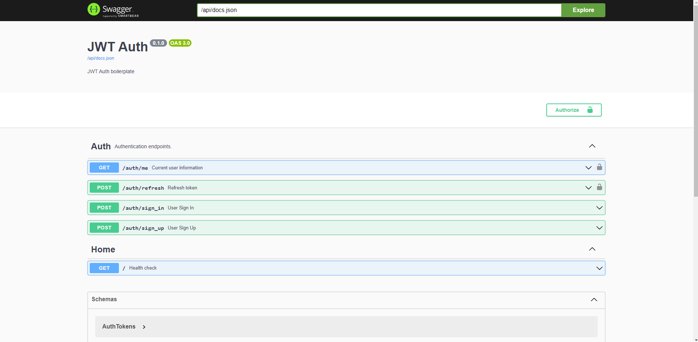

# Rust JWT Authentication Boilerplate

```md
rust-jwt-auth-boilerplate
├── src
│ ├── database
│ ├── middleware
│ ├── models
│ ├── routes
│ ├── swagger
│ ├── test
│ ├── utils
│ ├── lib.rs
│ └── main.rs
├── .env
├── .gitignore
├── Cargo.lock
├── Cargo.toml
├── docker-compose.yml
├── entity.sh
└── README.md
```

- [x] Axum (Routing, Middleware, etc..)
- [x] JsonWebToken
- [x] PostgreSQL
- [x] SeaORM (Model, Migration)
- [x] Swagger API Inspector

## Setup Dev Environment

Clone Repository

```
git clone https://github.com/felix1251/rust-jwt-auth-boilerplate.git <project-name>
cd <project-name>
```

### ENV variables

Create a .env file

```
touch .env
```

Add this variables (Feel free to add your desired values)

```
DB_USER=rs_auth
DB_NAME=rs_auth_db
DB_PASSWORD=password
DB_HOST=localhost
DB_PORT=5432
DATABASE_URL=postgres://${DB_USER}:${DB_PASSWORD}@${DB_HOST}:${DB_PORT}/${DB_NAME}
JWT_TOKEN_SECRET=secret
JWT_REFRESH_TOKEN_SECRET=secret
```

### Containerize

Create a docker container for the local DB

```
docker compose up -d
```

### Run App Locally

Make sure cargo watch installed (if not installed)

```
cargo install cargo-watch
```

Run

```
cargo watch -x run
```

### Migration

Install CLI

```
cargo install sea-orm-cli
```

Run Migration

```
sea-orm-cli migrate -d ./src/database/migration
```

Fresh Migration

```
sea-orm-cli migrate -d ./src/database/migration fresh
```

### Models/Entity

Generate Enitity

> SeaORM rewrites the files everytime we generate entity.
> You might have written ActiveModelBehavior for the model and we don't want it to be removed.
> Grab the generated entity in models temp folder and move to models folder

```bash
sea-orm-cli generate entity -o ./src/models_temp -t TABLE_NAME
# Ex. $ sea-orm-cli generate entity -o ./src/models_temp -t users
```

Alternative (Using Bash)

> I created a bash file to generate entity without rewriting models files.

```bash
bash entity.sh TABLE_NAME_1 TABLE_NAME_2
# Ex. $ bash entity.sh users tasks
```

### Own Git repository

Remove git folder, so you can add it to your own repo later.

```
rm -rf .git
```

## Screenshots


